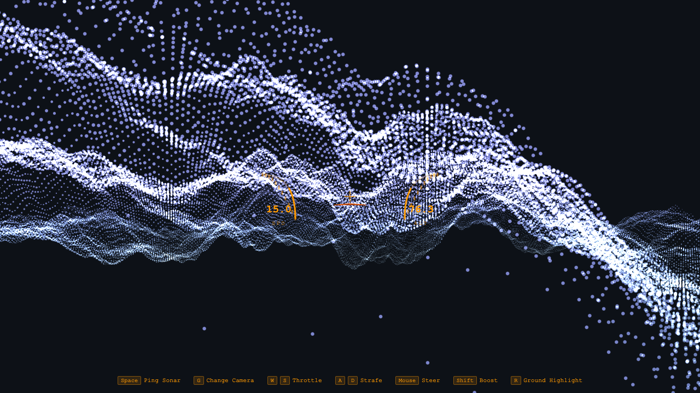
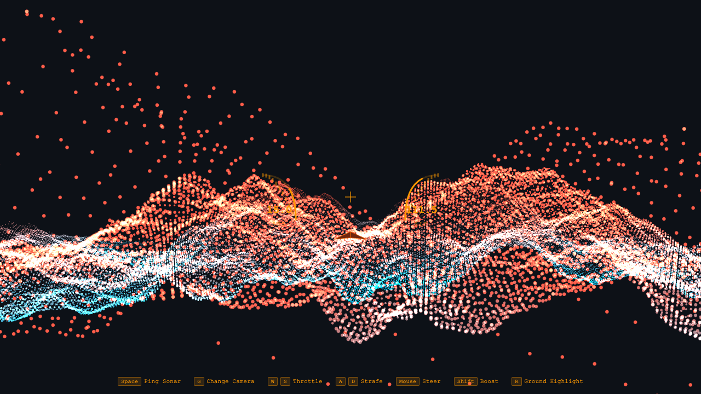

# Particle Flight

An infinite terrain flight simulator built with Three.js. Fly through a procedurally generated particle landscape.



## Inspiration

This project is inspired by [SCREE - Infinite Flight](https://www.scree.app/) by Taylor.

## Features

- **Infinite Procedural Terrain** - 150,000 particles generated using Simplex noise with fractal Brownian motion
- **Paper Airplane** - Wireframe aircraft with physics-based flight controls
- **Multiple Camera Modes** - Third-person, cockpit (first-person), and side view
- **Terrain Highlighting** - Toggle elevation visualization (cyan=low, red=high)
- **Sonar Ping Effect** - Expanding ring visual effect
- **Arc Gauges HUD** - Speed and altitude indicators



## Controls

| Key | Action |
|-----|--------|
| `Mouse` | Steer |
| `W` / `S` | Throttle up/down |
| `A` / `D` | Strafe left/right |
| `Shift` | Boost |
| `Space` | Sonar ping |
| `R` | Toggle terrain highlight |
| `G` | Cycle camera modes |

## Tech Stack

- **Three.js r170** - 3D rendering
- **Vite** - Build tool & dev server
- **Vanilla JavaScript** - No framework overhead
- **Custom GLSL Shaders** - Particle rendering with distance fog

## Project Structure

```
particle-flight/
├── index.html          # Main HTML with HUD elements
├── package.json        # Dependencies
├── vite.config.js      # Vite configuration
└── src/
    ├── main.js         # Entry point, game loop
    ├── terrain.js      # Particle terrain generation
    ├── airplane.js     # Paper airplane model
    ├── controls.js     # Flight physics & input
    ├── effects.js      # Sonar ping effect
    └── styles.css      # HUD styling
```

## Getting Started

```bash
# Install dependencies
pnpm install

# Start development server
pnpm dev

# Build for production
pnpm build
```

## License

MIT
